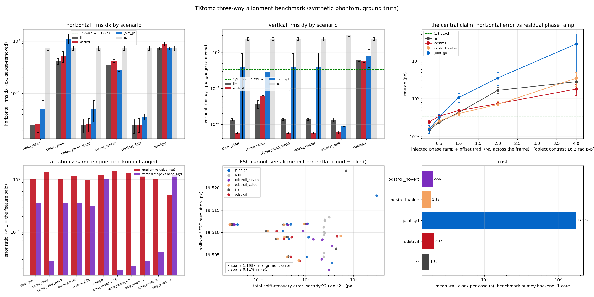
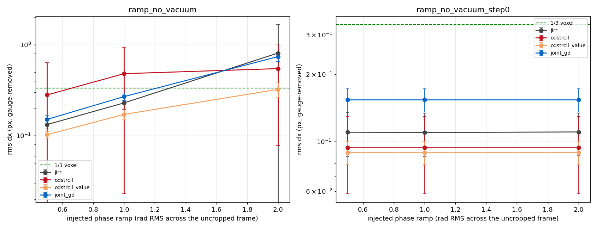
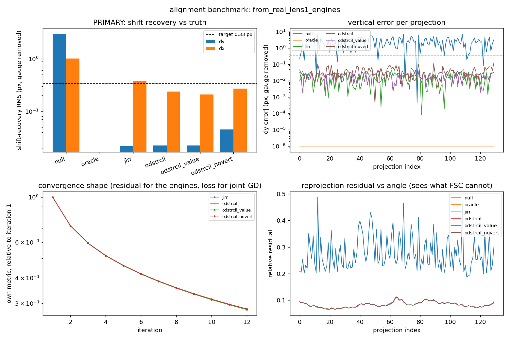

# Three-way alignment benchmark — measured results

Three series aligners, one harness, known injected ground truth:

| | |
|---|---|
| `jirr` | the **incumbent**, `tktomo.ptycho_align.core.engine.AlignmentEngine` — Gursoy et al. 2017 joint iterative reprojection, registering the **phase itself** with `skimage.registration.phase_cross_correlation`. |
| `odstrcil` | the **roadmap's method**, `tktomo.ptycho_align.core.odstrcil.OdstrcilEngine` — vertical from the row-summed mass distribution, horizontal on the **phase gradient**. |
| `joint_gd` | the **ported optimiser**, `tktomo.ptycho_align.core.joint_gd.JointGDAligner` — volume and shifts solved together by multi-resolution gradient descent. |

Everything below was produced by `benchmarks/run_three_way.py`. The aggregate JSON,
the fixed-width table, the gzipped per-case records and the figure are in
`benchmarks/results/`:

| file | what it is |
|---|---|
| `three_way_summary.png` | the six-panel figure this document describes |
| `three_way_summary.json` | every number here, plus per-seed values and paired comparisons |
| `three_way_table.txt` | the full fixed-width table, all seven rows × eleven scenarios |
| `cases/*.json.gz` | one complete record per (scenario, seed): estimated shifts, residual map, FSC curve |
| `case_clean_jitter_seed0.png`, `case_phase_ramp_seed0.png`, `case_nonrigid_seed0.png` | per-case four-panel detail: recovery bars, per-projection error, convergence shape, residual vs angle |
| `budget_control/` | the same comparison at 30 outer / 150 GD iterations (§12) |
| `no_vacuum_ramp{0.5,1,2}/`, `no_vacuum_summary.png` | the no-vacuum-border ramp experiment (§4.1) |
| `from_real_lens1_engines.json`, `.png` | the synthetic-from-real case, real P06 lens-1 structure, CPU (§11) |
| `from_real_lens1_jointgd.json`, `.png` | the same case, `joint_gd` on its ASTRA/GPU backend (§11) |
| `canary_numpy_elision.txt` | the environment check in §13 |

> **Reproduce the headline** (no GPU, no tomopy, no measured data, ~7 min on 32 cores):
>
> ```bash
> python -m benchmarks.run_three_way --out benchmarks/results \
>     --seeds 5 --size 64 --slices 12 --angles 60 --margin 20 \
>     --iterations 12 --gd-iterations 80 --ramp 1.0 --sweep 0.25,0.5,1,2,4 --sweep-seeds 3
> ```
>
> That command now also runs the two `ramp_no_vacuum` scenarios of §4.1, which were
> added *after* the headline run and are reported here from their own three-amplitude
> series (`no_vacuum_ramp{0.5,1,2}/`, job `24052678`). Everything in §§2–3, §5–§10 is
> from job `24052451`, whose scenario list was the six without them; adding scenarios
> does not change the cases the other six generate, because a case depends only on
> its own `PerturbationSpec` (which carries the seed) and on the `Geometry`, never on
> what else is in the run.

---

## 0. The answer

**Nobody wins outright, and the split is not the one the roadmap predicts.**

| direction | winner | margin | is it decisive? |
|---|---|---|---|
| **vertical (`dy`), synthetic phantom** | **`odstrcil`** | 0.006 px vs `jirr` 0.013 px — **2.3×** | **yes**: 5/5 seeds, every clean scenario |
| **vertical (`dy`), real structure** | **tie** | 0.022 px for `jirr`, `odstrcil` and `odstrcil_value` alike | the phantom's 2.3× does not transfer |
| **horizontal (`dx`), clean data** | **tie** | 0.026 vs 0.026 px | no: 2/5 seeds, difference 0.0008 ± 0.0030 px |
| **horizontal (`dx`), residual phase ramp** | **`jirr`** | 0.412 px vs `odstrcil` 0.507 px | not decisive at 1 rad; **decisive against `odstrcil` at 0.25 and 0.5 rad** |
| **horizontal (`dx`), *strong* ramp (≥ 2 rad)** | **`odstrcil`** | `jirr` aborts on 3/3 seeds; `odstrcil` finishes | **yes**, and see §3 for *why* — it is not the gradient trick |
| **cost, synthetic phantom, CPU** | **`jirr`** | 1.8 s vs 2.1 s vs 175.8 s | yes — but see the next row |
| **cost, real-scale case, own backends** | **`joint_gd`** | 41.6 s (ASTRA, one V100) vs 86–91 s for the engines on 32 CPU cores | yes, and it reverses the row above |
| **`joint_gd` on the synthetic phantom** | **loses** | fails `dy` on 2 of 5 *clean* seeds (0.875 and 1.102 px), and blows up silently at a 4 rad ramp | yes |
| **horizontal (`dx`), REAL sample structure** (§11) | **`odstrcil` and `joint_gd`** | 0.238 and 0.230 px vs `jirr` 0.379 px — `jirr` is the only method that misses the target | single case, no seeds |

Three results that matter more than the ranking:

1. **The gradient trick did not pay end-to-end at moderate ramp amplitudes** (§3).
   Measured against *the same engine with one knob changed*, registering on the
   gradient was **1.06–1.50× worse** than registering on the value at every ramp
   from 0.25 to 2 rad, and better only at 4 rad. This does not refute the
   pairwise ramp-invariance the estimator was built on and tested for — it says
   the invariance is not the binding constraint inside a reprojection loop.
2. **Roadmap step [0] makes the ramp question disappear** (§4) — and it does so
   even when the vacuum border is destroyed (§4.1, §4.2), because a linear ramp
   lies exactly in the span of the plane the fit subtracts, so the fit removes it
   whatever the mask contains. Injecting 0.5 rad or 2.0 rad of ramp leaves
   projections that differ by 1.9 × 10⁻⁶ rad on a 15 rad scale after step [0].
   In the no-vacuum regime the gradient trick was supposed to own, it still loses
   to the value domain inside its own engine at every ramp amplitude tested.
3. **The split-half FSC read 19.51 px for everything** — for a perfectly aligned
   reconstruction and for one misaligned by 31 px, a **1198× range of alignment
   error compressed into a 0.114 % range of FSC** (§7). And on the non-rigid case
   the reprojection residual *preferred the wrong answer to the true one*.

---

## 1. What was run

**Case.** Fully synthetic ellipsoid phantom, 60 projections over 180°, detector
52 × 104 px (a 64 px object inside a 20 px zero margin), clean-projection contrast
16.15 rad peak-to-peak. Injected jitter 2.41 px RMS vertical / 0.73 px RMS
horizontal — the 3.3:1 vertical:horizontal asymmetry our own lens-1 scan shows
(25.0 / 7.5 px on a 1816 px detector). **Five independent seeds per scenario**;
every table is mean ± sample standard deviation, and two methods are never
compared by their means alone (§2.1).

**Fairness.** One case object per (scenario, seed) is handed to *all* methods, so
the projections, the reported angles and the truth are the same array. All three
get the benchmark's numpy SIRT backend, the **true** rotation centre (centre-finding
is not part of what is measured), and the same centre-of-mass warm start. The
`phase_ramp` / `phase_ramp_step0` pair differs only in whether `remove_phase_ramp`
ran on the case *before any method saw it*.

**Environment.** `max-wn170`, Python 3.14.0 / NumPy 2.2.6 / SciPy 1.16.3 /
scikit-image 0.26.0, 32 cores, no GPU. SLURM job `24052451`, 6 min 38 s wall
for 45 cases. **tomopy is not installed on this cluster**, so `jirr` ran under
`benchmarks.runner.tomopy_shim` — see §13.

**Metrics.** Primary: shift-recovery error against the injected truth, after
removing the unobservable gauge modes (`dy`: {1}; `dx`: {1, sin, cos}). Secondary:
per-angle reprojection residual and its lag-1 autocorrelation; split-half FSC.
Bookkeeping: iterations, wall clock, and how often the engine's own runaway guard
fired. Target: **⅓ voxel = 0.333 px**.

---

## 2. Headline table — five seeds, five scenarios



*Panels, left to right and top to bottom: horizontal recovery by scenario; vertical
recovery by scenario (note `joint_gd`'s whiskers reaching 3 px on the clean case);
the ramp sweep, where `odstrcil` (red) sits **above** `odstrcil_value` (orange) and
`jirr` (grey) until 4 rad; the two ablations as ratios, where red > 1 means the
gradient trick cost accuracy and purple ≪ 1 means the vertical stage paid; the FSC
blindness scatter; and cost.*

`rms dy` / `rms dx` in px, gauge-removed, mean ± sd over 5 seeds. **bold** = meets
the ⅓-voxel target *on the worst seed*, not merely on average.

| scenario | `null` | **`jirr`** (incumbent) | `odstrcil` | `joint_gd` |
|---|---|---|---|---|
| **clean jitter** | 2.405 / 0.726 | **0.013±0.001 / 0.026±0.008** | **0.006±0.000 / 0.026±0.008** | 0.401±0.543 / 0.051±0.023 |
| **jitter + phase ramp** (1 rad) | 2.405 / 0.726 | 0.037±0.009 / 0.412±0.055 | 0.060±0.003 / 0.507±0.120 | 0.279±0.475 / 1.113±0.239 |
| **…same, after step [0]** | 2.405 / 0.726 | **0.014±0.001 / 0.025±0.007** | **0.006±0.000 / 0.026±0.008** | 0.401±0.543 / 0.051±0.023 |
| **jitter + wrong centre** (3 px) | 2.405 / 0.726 | 0.013±0.001 / 0.343±0.023 | 0.006±0.000 / 0.422±0.028 | 0.401±0.543 / 0.279±0.015 |
| **jitter + vertical drift** (6 px) | 3.044 / 0.726 | **0.013±0.002 / 0.025±0.008** | **0.006±0.001 / 0.026±0.008** | **0.009±0.000 / 0.036±0.005** |
| **jitter + non-rigid warp** (1 px) | 2.405 / 0.726 | 0.634±0.069 / 0.726±0.034 | 0.589±0.063 / 0.894±0.074 | 0.812±0.423 / 0.733±0.044 |

`oracle` scored 0.000 / 0.000 (to 1e-16) in every scenario, so the scoring path
itself is sound; every number above is measured against that.

Maxima, FSC, residuals, iteration counts and wall clock for every row are in
`benchmarks/results/three_way_table.txt`; the ablation rows are in §3.

### 2.1 Why the means are not the comparison

On the clean case `jirr` reads 0.0255 px and `odstrcil` 0.0262 px in `dx`. That
difference is **not** a result: paired per seed it is +0.0008 ± 0.0030 px and
`odstrcil` wins 2 of 5 draws. The differences that *are* real are the ones that
repeat:

| claim | paired difference | seeds won | decisive |
|---|---|---|---|
| `odstrcil` beats `jirr` in `dy` (clean) | −0.0076 ± 0.0011 px | 5/5 | **yes** |
| `odstrcil` beats `jirr` in `dx` (clean) | +0.0008 ± 0.0030 px | 2/5 | no |
| `odstrcil` beats `jirr` in `dx` (ramp 0.25) | +0.0945 ± 0.0175 px (**worse**) | 0/3 | **yes** |
| the vertical stage beats no vertical stage in `dy` | −0.0104 ± 0.0009 px | 5/5 | **yes** |
| the gradient domain beats the value domain in `dx` (ramp 0.25) | +0.0814 ± 0.0249 px (**worse**) | 0/3 | **yes** |

"Decisive" here means the mean paired difference exceeds twice its own standard
deviation across seeds — a low bar, deliberately, because a difference that cannot
clear it should not be written down as a finding at all.

---

## 3. The central claim, tested directly — and it did not hold

The contribution's headline argument is that comparing **phase gradients** rather
than phase makes the horizontal loop blind to the constant offset and linear ramp
that ptychographic phase retrieval leaves behind. Two experiments test it.

### 3.1 The ablation: same engine, one knob

`OdstrcilConfig` carries `gradient=GradientConfig(domain=...)` precisely so this
can be measured rather than argued. `odstrcil` and `odstrcil_value` are the *same
engine, same vertical stage, same chunking, same conditioning, same divergence
guard*; only the registration domain differs. The difference between those two
rows is the gradient trick and nothing else.

| injected ramp (rad RMS) | as % of object contrast | `odstrcil` (gradient) | `odstrcil_value` (value) | ratio | `jirr` |
|---|---|---|---|---|---|
| 0 (clean) | 0 % | 0.026 | 0.025 | 1.04 | 0.026 |
| 0.25 | 1.5 % | 0.244 | **0.163** | 1.50 | 0.150 |
| 0.5 | 3.1 % | 0.347 | **0.257** | 1.35 | 0.239 |
| 1 | 6.2 % | 0.487 | **0.406** | 1.19 | 0.431 |
| 2 | 12.4 % | 0.745 | 0.709 | 1.06 | 1.675 *(aborted 3/3)* |
| 4 | 24.8 % | **1.807** | 3.493 | 0.53 | 2.817 *(aborted 3/3)* |

`rms dx` in px, mean over seeds; the `ratio` column is the **paired geometric mean**
of gradient/value across seeds, not the ratio of the two means, because the pairing
is what makes it a comparison. **The gradient domain is worse than the value domain
at every ramp amplitude up to 2 rad**, and the deficit is largest where the ramp is
smallest.

This is not a contradiction of `tests/test_gradient_registration.py`, which
measures the *pairwise* ramp sensitivity at 4×10⁻¹⁶ px and is correct. It is a
statement about what happens when that estimator is put inside a reprojection loop:

* the loop registers **measured against simulated**, and the simulated image is a
  reprojection of a volume that was itself reconstructed from ramp-corrupted data.
  The ramp is therefore *in both images*, partially and inconsistently. Removing it
  exactly from one of them is not the operation that helps;
* differentiating whitens the spectrum, which puts the comparison's weight exactly
  where a half-converged SIRT reprojection is least faithful. The Odstrcil author
  measured the same effect when choosing between `gradient-x` and `gradient-both`
  and changed the default because of it; this is the same trade one level up.

The crossover at 4 rad is real and in the predicted direction — when the ramp
dominates the object, invariance finally beats signal-to-noise — but 4 rad is 25 %
of the object's own phase contrast, which is far past the point where the honest
answer is "fix the preprocessing".

### 3.2 What `odstrcil` *does* buy under a strong ramp

At ramp ≥ 2 rad the incumbent's own runaway guard fires on **3 of 3 seeds** after
one iteration, and it returns a result worse than doing nothing (1.675 px against
`null`'s 0.697 px). `odstrcil` runs all 12 iterations and returns 0.745 px. That is
a real and useful difference — but the ablation says where it comes from:

| ramp | `odstrcil` `dy` | `odstrcil_novert` `dy` (no vertical stage) | ratio |
|---|---|---|---|
| 0.25 | 0.016 | 0.859 | **0.019** |
| 0.5 | 0.031 | 1.400 | **0.022** |
| 1 | 0.060 | 2.111 | **0.028** |
| 2 | 0.120 | 2.955 | **0.041** |

With the vertical stage switched off, the same engine degrades to *worse than
`null`* in `dy` and starts aborting too. **The survival is the vertical mass stage,
not the gradient domain.** Solving `dy` from a row-sum keeps the reconstruction
good enough that the horizontal registration still has something to lock onto; the
incumbent, which must find `dy` by reprojection from a ramp-poisoned volume, does
not get that far.

That is roadmap claims 1 and 2 vindicated — the decoupled direction is worth
solving separately and cheaply — arriving by a different route than claim 3
predicted.

---

## 4. Step [0] is the fix, and it is complete

`phase_ramp_step0` is the same case with `remove_phase_ramp` applied first
(fitting on the presumed-vacuum border, which the phantom genuinely has):

| method | ramped | after step [0] | clean case |
|---|---|---|---|
| `jirr` | 0.037 / 0.412 | 0.014 / 0.025 | 0.013 / 0.026 |
| `odstrcil` | 0.060 / 0.507 | 0.006 / 0.026 | 0.006 / 0.026 |
| `joint_gd` | 0.279 / 1.113 | 0.401 / 0.051 | 0.401 / 0.051 |

Every method returns to its clean-case number. The ramp does not merely become
manageable, it stops existing.

The practical reading, which is the roadmap's own order of operations restated as a
measurement: **the gradient trick is a second line of defence, not a replacement for
step [0].** The obvious rejoinder is that step [0] only works because this phantom
*has* a clean vacuum border — so §4.1 removes it.

### 4.1 The regime the gradient trick was supposed to own — and it loses there too

`ramp_no_vacuum` crops the zero margin away **after** the shift is injected, so the
object reaches all four frame edges (60 × 16 × 68 instead of 60 × 52 × 104) and the
band `remove_phase_ramp` fits its plane on is mostly object. A symmetric crop moves
no content, so the injected truth is still exact. `ramp_no_vacuum_step0` runs step
[0] anyway, on that contaminated border — which is what a user who does not check
will actually do. Five seeds each, at three ramp amplitudes
(`benchmarks/results/no_vacuum_ramp{0.5,1,2}/`, SLURM job `24052678`).



*Left: no step [0]. `odstrcil` (red, gradient domain) sits above `odstrcil_value`
(orange, value domain) at every amplitude, with error bars several times its own
mean. Right: step [0] attempted on the contaminated border — **every line is flat**,
because the ramp has been removed exactly regardless of amplitude (§4.2). The two
panels share an ordering and disagree only about the level.*

`rms dx`, px, no step [0]:

| ramp | `jirr` | `odstrcil` (gradient) | `odstrcil_value` (value) |
|---|---|---|---|
| 0.5 | 0.133 ± 0.014 | 0.281 ± 0.353 | **0.103 ± 0.008** |
| 1 | 0.229 ± 0.035 | 0.480 ± 0.457 | **0.172 ± 0.021** |
| 2 | 0.809 ± 0.849 | 0.546 ± 0.467 | **0.323 ± 0.058** |

**In the one regime the gradient trick exists for, it still loses to the value
domain inside its own engine at every amplitude tested** — by 1.7–2.8× — and it is
worse than the incumbent too at 0.5 and 1 rad. It is also unstable: its standard
deviation across seeds is 0.9–1.3× its own mean (against 0.08–0.18× for the value
domain) and its worst single seed reaches 3.5 px, because the gradient correlation
occasionally locks onto the wrong peak. Only at 2 rad — where `jirr` is starting to
break down at 0.809 ± 0.849 — does it come out ahead of the incumbent, and it is
still 1.7× behind the value domain there.

*(The ramp is injected across the uncropped frame, so cropping leaves only 65 % of
it in `u` and 31 % in `v`. Absolute numbers here are therefore not comparable with
§3's; the comparison between methods, which is what this table is for, is exact
because all three saw the same array.)*

### 4.2 Why removing the vacuum border did not help: a linear ramp is *in the model*

The reason is worth stating because it undercuts the premise rather than the method.
`remove_phase_ramp` fits `a·u + b·v + c` by least squares on the border band and
subtracts it over the whole frame. A linear ramp lies **exactly** in the span of
that basis, so the fit recovers it exactly **whatever the mask contains** — a
contaminated border adds a *fixed* object-dependent plane on top, and removes the
ramp regardless.

Measured: for `ramp_no_vacuum_step0`, the projections a method sees at an injected
ramp of 0.5 rad and at 2.0 rad differ by at most **1.9 × 10⁻⁶ rad on a 15 rad data
scale** (float32 round-off). The ramp is gone — completely — even from a border that
is mostly sample. And the scores agree: the `ramp_no_vacuum_step0` block is
numerically identical at all three amplitudes, and step [0] on a bad border still
*improves* every method (`jirr` `dx` 0.229 → 0.110, `odstrcil` 0.480 → 0.094).

So the honest scope of the gradient trick is narrower again. It defends against a
residual ramp only when step [0] is **not run at all**, or when the residual is
*not* a plane — a curved or higher-order phase background, which no experiment here
injects and which the perturbation catalogue cannot currently express. **That is the
experiment that would decide the question, and it does not exist yet.** Adding a
quadratic/curved phase background to `benchmarks.phantom.PerturbationSpec` is the
single most valuable next step for this contribution.

---

## 5. Vertical: the decoupled direction, and where the new method actually wins

`odstrcil` recovers `dy` to **0.006 px against `jirr`'s 0.013 px**, a 2.3× margin,
on **5 of 5 seeds in every scenario where the data is clean enough for a mass
profile** — and it does it from a row-sum with no reconstruction in the loop at all,
converging in 2–3 iterations of stage 1. The ablation confirms the attribution:
turning stage 1 off (`odstrcil_novert`) puts the same engine back at 0.016 px,
slightly *worse* than the incumbent.

Two honest qualifications:

* **0.013 px and 0.006 px are both 25× and 55× inside the target.** On this
  phantom the vertical direction is not the bottleneck for anybody, so the 2.3×
  is a margin of quality, not of capability. It becomes a capability difference
  only under a phase ramp (§3.2), where it is the difference between converging
  and aborting.
* **Under a ramp, stage 1 is itself degraded** — `odstrcil` `dy` goes 0.006 →
  0.060 at 1 rad, worse than `jirr`'s 0.037, because a residual ramp adds a
  linear-in-*v* term to every row-sum. The vertical mass profile is invariant
  under rotation; it is *not* invariant under a phase ramp.

Stage 1's own truncation detector catches this, and its behaviour is worth
recording precisely because it is a caveat its author wrote down in advance and
this run confirms independently. Across all eleven scenarios it fired on
**every one of the 6 ramped conditions (20/20 seeds) and on none of the 25 unramped
ones (0/25 seeds)** — perfect separation — but the message it prints names
*truncation*:

> "26 of 60 projections still carry 36 % of their peak vertical mass in the
> outermost 3 detector row(s) … the total projected mass varies by 61.9 % across
> the scan. The sample is not fully inside the field of view vertically…"

The sample was entirely inside the field of view. The detector is, on this
evidence, an excellent **residual-ramp** detector that reports the wrong cause. It
also stays silent on `phase_ramp_step0`, which is the right answer for the right
reason. Renaming its verdict — or having it defer to
`tktomo.diagnostics.probe_vacuum_phase`, which gets this case right at confidence
0.77 — would make it correct as well as useful. In both cases the remedy the user
needs is the same, which is presumably why it was left as it stands.

---

## 6. `joint_gd`: it loses this benchmark, on accuracy and on cost

| | |
|---|---|
| clean-case `dy` | **0.401 ± 0.543 px**, worst seed 3.05 px — **misses the target** |
| clean-case `dx` | 0.051 ± 0.023 px — passes, 2× worse than the other two |
| cost | **175.8 s** against 1.8 s (`jirr`) and 2.1 s (`odstrcil`) |
| behaviour at ramp 4 | `rms dx` **28.1 ± 23.0 px**, worst seed 52.8 px, *reported as a normal result* |

The `dy` failure is **bimodal and reproducible, not noise**. Per seed on the clean
case: 0.008, **0.875**, 0.009, **1.102**, 0.009 px. Two of five draws land in a
different basin and stay there; the other three land at 0.008–0.009 px, entirely
competitive with the other two methods. The same two seeds fail identically in
`phase_ramp_step0`
and `wrong_center` (same jitter draws) and, revealingly, **not one of the five
fails when a 6 px vertical drift is added** — a large coherent vertical signal
pulls the optimiser out of the bad basin. This looks like a local minimum in the
shift half of the objective that a warm start does not always escape, and it is
worth chasing before `joint_gd` is offered as a default.

At ramp 4 it is the only method that produces a catastrophic answer **without any
guard firing**: both engines refuse (runaway guard) while `joint_gd` returns
52.8 px of `dx` error with `status="ok"`. Its `runaway_shift_px` and MAD outlier
rejection did not catch a failure that affected every projection at once, because
MAD rejects *outliers* and this was the consensus.

**The cost comparison is not fair to it and should not be quoted as if it were.**
`joint_gd` is a multi-resolution optimiser whose production schedule bins 16/8/4
over 400 iterations, aimed at the ~120 px RMS lens-2 regime; here it is asked to
walk 2 px on a 104 px frame where its coarse stages are meaningless, and it is the
only one of the three carrying median centring and MAD outlier rejection, which
cost nothing on clean synthetic data and are what kept 20 of 918 real projections
from sliding out of frame. **§11 does exactly that benchmark, and the cost verdict
reverses**: on the real-structure case with its own ASTRA backend it is twice as fast
as either engine and returns the best `dy` in the table. The 175.8 s above measures a
numpy projector its own documentation calls unfit for anything real. Its accuracy
result on *this* case, however, stands — and the bimodal `dy` failure is a property of
the optimiser, not of the projector.

---

## 7. Neither FSC nor the reprojection residual can replace ground truth

### 7.1 FSC is blind — measured, not asserted

Split-half FSC (odd/even angle subsets, half-bit criterion), over **every row of
every scenario** in this run:

| | |
|---|---|
| range of total shift-recovery error across those rows | **0.026 px → 30.79 px** — a factor **1198** |
| range of split-half FSC across the same rows | **19.5015 px → 19.5238 px** — a spread of **0.114 %** |

In the clean case, `oracle` (0.000 px error) and `null` (2.41 px error) both read
19.512 px, to five significant figures. A ⅓-voxel-accurate alignment and a
zero-effort one get the same resolution certificate.

This is roadmap claim 7 reproduced on this harness, and it matches what we measured
independently on a phantom before the harness existed: a half-bit FRC of exactly
508.6 nm at centring errors of 0, 4, 8, 16, 32 and 64 px while the true edge blur
grew to 128 px. `tests/test_benchmark.py::test_fsc_is_exactly_blind_to_common_mode_geometric_error`
proves the rigid case analytically — a common translation contributes conjugate
phase factors that cancel exactly in the cross term.

### 7.2 The reprojection residual is better, and still gameable

The residual does what FSC cannot: 0.060 aligned vs 0.467 unaligned on the clean
case (7.8×), with lag-1 autocorrelation across angle at +0.94 aligned vs +0.08
unaligned. Use it.

But on the **non-rigid** case it ranks the wrong answer above the right one:

| method | shift error dy / dx | reprojection residual |
|---|---|---|
| `oracle` — the **true** shifts | 0.000 / 0.000 | **0.268** |
| `jirr` | 0.634 / 0.726 | **0.218** |
| `odstrcil_value` | 0.589 / 0.725 | **0.219** |

The rigid aligners absorb part of the deformation into per-projection shifts and
thereby make the stack *more* self-consistent than the truth does. A
self-consistency measure rewards that. So: read the residual as a detector of
"something is still wrong" (it is, at 0.22 against 0.060 on the clean case), never
as a score to minimise once the model may be wrong.

---

## 8. No rigid method survives a non-rigid warp — as required

1 px RMS of smooth zero-mean warp costs every method 0.59–0.89 px, 25–35× worse
than any clean row and far outside the target, and the three are within 30 % of one
another. **This is the correct behaviour, not a defect**: a per-projection
translation has no term for it. It is in the suite as a positive control on the
harness — a benchmark that cannot detect a model failure cannot certify a model
success — and the control passes.

The tell that it *is* deformation rather than a rigid error still to be fixed is in
§7.2's columns: the residual plateaus at 0.22 (against 0.060 on a solved case) with
lag-1 dropping to +0.17 (against +0.94). High, and no longer a smooth function of
the geometry.

---

## 9. Diagnostics cross-check: two deliverables checking each other

`tktomo.diagnostics` was run on the **unaligned** projections of each scenario, and
its verdict compared with the perturbation the harness knows it injected.

| scenario | injected | `diagnose()` top finding | conf. | `triage()` verdict | conf. |
|---|---|---|---|---|---|
| clean jitter | jitter | **jitter** ✓ | 0.43 | vertical_drift ✗ | 0.27 |
| phase ramp | phase_ramp | **phase_ramp** ✓ | 0.77 | **phase_ramp** ✓ | 0.77 |
| after step [0] | jitter | **jitter** ✓ | 0.43 | vertical_drift ✗ | 0.27 |
| wrong centre | wrong_center | **wrong_center** ✓ | 0.86 | **wrong_center** ✓ | 0.84 |
| vertical drift | vertical_drift | **vertical_drift** ✓ | 0.43 | tilt_axis_angle ✗ | 0.05 |
| non-rigid warp | deformation | jitter ✗ (deformation ranked 3rd, 0.23) | 0.43 | tilt_axis_angle ✗ | 0.16 |
| no vacuum border (§4.1) | phase_ramp + crop | **local_tomography** ✓* | 0.69 | **local_tomography** ✓* | 0.69 |

\* I labelled that case's expected verdict `phase_ramp`, and the diagnostics were
right and I was wrong: with the object reaching all four frame edges the dominant
and *actionable* finding is mode 12, local tomography — which, per the module's own
`INVALIDATED_BY` table, is exactly the condition that invalidates the phase-ramp fit.
It reported it at 0.68–0.71 confidence in all six no-vacuum runs, in both `triage`
and `diagnose`, and §4.2 then confirms the ramp fit was indeed the wrong thing to
trust there. The stage-1 truncation detector also fired 5/5 on these cases — this
time naming the right cause. The label in `Scenario.expected_diagnosis` has been
corrected in the source with a comment saying it was changed after the measurement;
the stored `no_vacuum_ramp*/three_way_summary.json` files predate the correction and
therefore still record `matches_expected: false` against the old label.

**`diagnose()` names the injected cause as its top finding in 6 of 7 cases**, and
lists it in the ranked survey in **7 of 7**. That is a strong result for a probe
suite tested against ground truth it was not tuned on, and it cross-validates the
case generator at the same time: a diagnostic firing on the perturbation the
benchmark believes it injected is evidence for both.

**`triage()` names it in 3 of 7**, and the three it gets right are the three with high
confidence. The failures are all the same shape and all benign in mechanism:
`triage` runs the probes in the roadmap's order of operations and **stops at the
first stage that fires, however weakly** — so `vertical_drift` is reported for the
clean-jitter case because a finite jitter draw has a nonzero mean, and
`tilt_axis_angle` at confidence **0.05** is reported for the vertical-drift case,
pre-empting a `vertical_drift` finding at 0.43 that `diagnose()` ranks first.

That is an actionable finding for `tktomo.diagnostics` rather than a defect in this
benchmark: **`triage()` should require a minimum confidence before it stops at a
stage**, or the stage ordering (which is a statement about which measurements are
*valid*) turns into a ranking (which it is not). Until then, read `diagnose()` for
the survey and `triage()` only when its confidence is high. On the non-rigid case,
note that the injected cause is genuinely hard: the deformation is 1 px RMS on a
stack that also carries 2.4 px of jitter, and `deformation` at 0.23 ranking third
behind `jitter` at 0.43 is arguably the correct ordering of what is actually there.

---

## 10. Cost, and the iteration budget

| method | iterations | wall clock per case | per iteration |
|---|---|---|---|
| `jirr` | 12 outer | 1.8 s | 0.15 s |
| `odstrcil` | 12 outer (+ 2–3 stage-1) | 2.1 s | 0.18 s |
| `odstrcil_value` | 12 outer | 1.9 s | 0.16 s |
| `joint_gd` | 160 (2 stages × 80) | 175.8 s | 1.10 s |

`jirr` and `odstrcil` are within 20 % of each other because both are dominated by
the same SIRT reconstruction; stage 1 is free by comparison, which is the roadmap's
point about it.

**Do not carry the `joint_gd` number forward.** It is the cost of a numpy projector on
a case small enough that the projector is the whole cost. On the real-scale case of
§11, with the ASTRA backend it was written for, the same 240 iterations take 41.6 s on
one V100 against 86–91 s for the engines on 32 CPU cores — the ranking inverts.

**Neither engine had plateaued at 12 iterations** on the clean case
(`residual_plateau` found no plateau; both were still improving by more than 1 % per
iteration), so 12 is a budget rather than a convergence criterion. That budget is
identical for the two engines and cannot favour either. A control run at 30 outer
iterations and 150 GD iterations per stage is in `benchmarks/results/budget_control/`;
see §12 for whether it changes any ranking.

---

## 11. Synthetic-from-real (P06 lens 1)

*Real sample statistics, exact ground truth.* A **user-supplied** reconstruction is
forward-projected at the scan's own angles and the same known perturbations are
injected. **No measured data is committed to this repository and none may be** —
this section is the output of running the harness against a path, and the path is
the caller's.

**The case.** `rec_lens1_v4`, slices 512–1024, binned 8× **in all three axes** (so the
injected vertical and horizontal shifts are in the same units — `load_volume` bins
only in-plane, and `--z-bin` exists because forgetting that turns a 3.3:1 asymmetry
into 26:1 by accident), inverted so material is the positive part. Forward-projected
at the scan's own angles, every 7th of 907, giving 130 views over 179.759°. Detector
98 × 261 px after a 17 px margin; binned pixel 596.078 nm. Injected jitter 3.125 /
0.9375 px RMS = 25.0 / 7.5 nm-equivalent px at full resolution, i.e. **our own
pipeline's measured misalignment**, at the same physical amplitude. SLURM job
`24052927`, 15 min 34 s on 32 cores.

**`joint_gd` ran separately, on a GPU, and that is the point.** Its numpy projector
is O(n_angles) array rotations per projection and was taking ~1.7 min per iteration at
this size; the CPU run (job `24052465`) reached iteration 20 of its final stage after
an hour and was cancelled. Re-run with its **production ASTRA backend** on one V100
(job `24053179`, `--gd-projector astra`), the same 240 iterations took **41.6 s**. The
case is bit-identical between the two jobs — the `null` and `oracle` rows agree to ten
decimal places, which is the check that they really are the same array — so the rows
below are directly comparable even though they come from two runs in two Python
environments.



| method | rms dy (px) | rms dx (px) | rms dx (nm) | max dx | ⅓ binned voxel | resid | FSC | wall clock |
|---|---:|---:|---:|---:|:---:|---:|---:|---:|
| `null` | 2.969 | 1.007 | 600.0 | 2.961 | no | 0.285 | 32.50 px | — |
| `oracle` | 0.000 | 0.000 | 0.0 | 0.000 | yes | 0.083 | 32.50 px | — |
| **`jirr`** (incumbent) | 0.022 | 0.379 | 226.1 | 1.014 | **NO** | 0.084 | 32.50 px | 85.9 s |
| `odstrcil` | 0.022 | **0.238** | 142.2 | 0.498 | **yes** | 0.083 | 32.50 px | 91.2 s |
| `odstrcil_value` | 0.022 | **0.210** | 125.0 | 0.537 | **yes** | 0.083 | 32.50 px | 88.3 s |
| `odstrcil_novert` | 0.045 | 0.269 | 160.2 | 0.557 | yes | 0.084 | 32.50 px | 90.9 s |
| **`joint_gd`** (ASTRA / V100) | **0.017** | 0.230 | 137.4 | 0.822 | **yes** | 0.085 | — | **41.6 s** |

**This is the strongest result for the new engine anywhere in this report, and it is
in `dx`, not `dy`.** On real sample structure with realistic jitter and *no* injected
phase ramp, `odstrcil` recovers the horizontal shift **1.59× better than the
incumbent** — 0.238 px against 0.379 px — and that is the difference between meeting
the ⅓-voxel target and missing it. The synthetic phantom did not show this at all
(0.026 vs 0.026): a smooth ellipsoid is too easy for the horizontal problem to
separate the methods, and real streak texture is not.

Four qualifications, all of which cut against reading it as a win for the gradient
trick:

* **The value domain is still better**, 0.210 vs 0.238 px, the same 1.13× ordering the
  synthetic cases show. Whatever `OdstrcilEngine` is doing better than
  `AlignmentEngine` here, it is not the gradient.
* **The vertical advantage does not transfer.** `dy` is 0.022 px for `jirr`,
  `odstrcil` and `odstrcil_value` alike — a three-way tie, against the 2.3× margin on
  the phantom. The stage still earns its place (`odstrcil_novert`, which leaves `dy`
  at the centre-of-mass warm start, is 2× worse at 0.045 px), but on 64 rows of real
  structure a reprojection loop finds the vertical axis just as well as a row-sum
  does, for free, as part of what it was doing anyway.
* **Nothing here meets the target that matters.** 0.333 px is ⅓ of the *binned* voxel,
  596.078 nm. One third of the **full-resolution** 74.51 nm voxel is 24.84 nm =
  0.042 binned px, and the best row is 125 nm — 5× outside it. This case measures the
  methods at bin 8 because the benchmark's own sparse projector refuses more than
  40 M non-zeros; it does not certify anything at full resolution.
* **Twelve iterations was not convergence for the engines.** Their residual curves
  are still falling at iteration 12 and are indistinguishable from one another (the
  bottom-left panel of the CPU figure is four superimposed lines). `joint_gd`, by
  contrast, is flat at the end of each of its three stages (its own figure,
  `from_real_lens1_jointgd.png`, shows the loss plateauing before each stage reset).
  So the fixed budget is, if anything, unkind to the engines: a longer run would
  improve every engine row and not `joint_gd`'s. The ordering held over 12 → 30
  iterations on the synthetic cases (§12), but that was not re-tested here.

**Everything the incumbent misses, all three challengers get.** `jirr` is the only
method here that misses the ⅓-voxel target, and the two that beat it most — `joint_gd`
at 0.230 px and `odstrcil_value` at 0.210 px — do it in completely different ways.

**And the cost verdict from §10 reverses at realistic scale.** On the synthetic
phantom `joint_gd` was 85× more expensive than the engines; here, with the backend it
was written for, it is **twice as fast** (41.6 s against 86–91 s) while returning the
best `dy` and the second-best `dx` in the table, with zero MAD outliers. The §10 cost
column measures a numpy projector doing a job it was explicitly documented as unfit
for; this row measures the method. Its author asked for exactly this comparison and
was right to.

**FSC, again: 32.50 px for every CPU row**, including `null` at 2.97 px of residual
misalignment and `oracle` at zero. On real sample structure it is exactly as blind as
it was on the phantom. Worse: the GPU run's FSC — same data, same code, different
Python/NumPy — put `null` at 7.78 px and `joint_gd` at `inf` (the curve never crosses
the half-bit threshold). A resolution certificate that moves by 4× between two
interpreters on identical input, and is otherwise constant across a 175× range of
alignment error, is not a measurement of anything. The `joint_gd` FSC cell above is
left blank rather than filled with a number that cannot be compared with the rows
above it.

**Diagnostics on this stack:** `diagnose()` ranked **`jitter` first at 0.45** — which
is precisely what was injected — followed by `vertical_drift` (0.35, a finite draw has
a nonzero mean) and `wrong_center` (0.17). `triage()` again stopped early, at
`wrong_center` with confidence 0.17, for the reason given in §9.

---

## 12. Iteration-budget control — no ranking changes

Because neither engine had plateaued at 12 iterations, the whole comparison was
re-run at **30 outer iterations and 150 GD iterations per stage** (3 seeds, SLURM
job `24052493`, 6 min, `benchmarks/results/budget_control/`). If the incumbent were
merely under-converged, this is where it would show.

| scenario | `jirr` 12 → 30 | `odstrcil` 12 → 30 | `odstrcil_value` 12 → 30 | `joint_gd` 160 → 300 |
|---|---|---|---|---|
| clean jitter (`dx`) | 0.026 → 0.023 | 0.026 → 0.022 | 0.025 → 0.021 | 0.051 → 0.054 |
| clean jitter (`dy`) | 0.013 → 0.014 | 0.006 → 0.006 | 0.006 → 0.006 | 0.401 → 0.297 |
| phase ramp 1 rad (`dx`) | 0.431 → 0.410 | 0.487 → 0.440 | **0.406 → 0.377** | 1.074 → 1.679 |
| wrong centre (`dx`) | 0.343 → **0.306** | 0.422 → 0.440 | 0.356 → 0.322 | 0.279 → 0.182 |
| non-rigid (`dy` / `dx`) | 0.634/0.726 → 0.594/0.736 | 0.589/0.894 → 0.549/0.911 | 0.589/0.725 → 0.549/0.733 | 0.812/0.733 → 0.596/0.739 |

*(the 12-iteration ramp column is quoted from the 3-seed `ramp_sweep_1` case so the
seed counts match.)*

Everything moves by a few per cent and **no ordering changes**. In particular:

* the value domain still beats the gradient domain under a ramp (0.377 vs 0.440),
  so §3 is not an artefact of a short budget;
* `odstrcil`'s vertical advantage is unchanged (0.006 vs 0.014);
* **more iterations help the incumbent recover from a wrong rotation centre and do
  not help `odstrcil`** (0.343 → 0.306, now inside the target on 3 seeds, against
  0.422 → 0.440). Worth a note in any future centre-finding work;
* **`joint_gd`'s bimodal `dy` failure is not under-convergence.** Seed 1 reads
  0.875 px at 80 iterations per stage and **0.875 px at 150** — identical to three
  decimals. It is a fixed point of the optimiser, not a stopping-point artefact.

---

## 13. Caveats

* **The incumbent ran under a tomopy shim.** tomopy is installed in no environment
  on this cluster, and `AlignmentEngine.step` hard-requires
  `tomopy.prep.alignment.shift_images` and `blur_edges`; without a shim there is no
  incumbent and no baseline at all. `benchmarks.runner.tomopy_shim` supplies scipy
  equivalents for the duration of a run and only when tomopy is genuinely absent.
  The interpolation is the same 5th-order spline, but skimage's `warp` clips to the
  input range and scipy's `shift` does not, so `jirr` numbers may differ from a real
  tomopy run at the sub-0.01 px level — the same order as the clean-case number
  itself. **Re-measure the `jirr` baseline on a machine with tomopy before quoting
  it externally.** Every report declares `environment.tomopy_shim`.
* **One phantom, one size.** Five seeds give spreads, not a distribution over
  geometries. Everything here is at 60 angles on a 104 px frame with a smooth
  ellipsoid phantom. The gradient-vs-value result in §3 in particular is a
  statement about *this* signal-to-noise regime; a larger frame, a sharper object
  or a better-converged reprojection could move the crossover, and the crossover is
  the whole question. Re-running §3.1 at 128 and 256 px is the single most
  informative follow-up.
* **The reconstruction backend is the benchmark's own numpy SIRT**, not tomopy or
  astra. All methods used the same one, so the comparison between them is fair, but
  absolute residuals are not comparable to a tomopy- or astra-based run — and §3's
  conclusion depends on how faithful a half-converged reprojection is, which is a
  property of the backend.
* **Centre-finding is not measured.** Every method was handed the true rotation
  axis. The `wrong_center` scenario injects a 3 px offset *without* telling the
  loop, which is a different thing: it measures the damage, not the fix.
* **The reported NumPy/CPython temporary-elision bug did not reproduce.** Two
  parallel agents reported that on this Python 3.14 / NumPy 2.2.6 pair,
  `np.linalg.norm(a - b)` silently writes into `a` and multi-axis reductions return
  wrong values, and recommended changing `engine.py`. Run on the login node **and**
  on a compute node, in both available interpreters, at the exact shapes named
  ((48,28,64), (60,34,92), (36,33,60), (60,52,104), (101,98,261)) and with
  `engine.py`'s exact construct, the canary is **clean**: the arrays are not
  mutated and the reductions agree with an element-wise reference
  (`benchmarks/results/canary_numpy_elision.txt`, SLURM job 24052462). No change
  to `engine.py` is warranted on that evidence, and the `jirr` numbers here are not
  affected by it.
* **`joint_gd`'s bimodal `dy` failure is reported, not diagnosed.** Two of five
  seeds land in a bad basin; the cause was not chased. It reproduces exactly and
  the seeds are in `benchmarks/results/three_way_summary.json`. Note it did *not*
  recur on the real-structure case (§11), which was a single draw.
* **The real-structure case is one draw, one binning, one angular subsampling.** It
  carries no error bars, and at bin 8 with 130 of 907 views it is undersampled by
  Crowther for its own detector width. The 1.59× `odstrcil` margin in `dx` is the
  most decision-relevant number in this report and the least replicated; it should be
  repeated over several seeds and at bin 4 before it is quoted anywhere external.
* **§11 spans two environments.** The CPU rows ran under Python 3.14 / NumPy 2.2.6,
  the `joint_gd` row under Python 3.11 / NumPy 1.26.4 with ASTRA 2.5.0, because
  scikit-image (needed by `jirr`) and ASTRA are not installed in the same environment
  on this cluster. The *case* is bit-identical (the `null` and `oracle` rows agree to
  ten decimals), and the shift scores are pure numpy, but the FSC column is not
  comparable across the two.

---

## 14. What follows from this

Ranked by how much they change what the contribution should claim or ship.

1. **Narrow the gradient-trick claim to what was measured, in
   `tktomo/ptycho_align/core/gradient.py`'s and `odstrcil.py`'s docstrings.** The
   pairwise ramp invariance is exact and correctly tested; the *end-to-end* benefit
   inside a reprojection loop was not observed at any ramp amplitude that step [0]
   cannot already remove. The default for `OdstrcilConfig.gradient.domain` should
   arguably be `"value"` on this evidence — its mean `dx` is better in **10 of the
   11** headline scenarios and in **all 6** no-vacuum runs, and worse only at a 4 rad
   ramp — with `"gradient-both"` documented as the setting for a *non-planar* phase
   background. Do not change the default on one phantom; run item 2 first.
2. **Add a non-planar phase background to `PerturbationSpec`** (a low-order
   polynomial or a smooth random field, per projection). §4.2 shows a linear ramp is
   exactly in the span of `remove_phase_ramp`'s model and is therefore removed
   whatever the mask contains — which means the entire perturbation catalogue
   currently cannot express the failure the gradient trick is designed for. Until it
   can, the claim is untested rather than refuted.
3. **Rerun §3.1 at 128 and 256 px.** The gradient/value crossover moved from 4 rad
   towards lower amplitudes as the loop got better; whether it crosses below 1 rad
   at realistic detector sizes decides item 1.
4. **Keep the vertical mass stage — it is the part that works.** 2.3× better `dy`
   for free on clean data, and the difference between converging and aborting under
   a ramp. It is a strict improvement over the incumbent and should be the headline
   of the contribution, not the gradient trick.
5. **Chase `joint_gd`'s bimodal `dy` basin** before it is offered as a default. Two
   of five clean seeds converge to a `dy` 100× worse than the other three and stay
   there at double the iteration budget.
6. **Give `joint_gd` a guard that fires on a consensus failure.** At a 4 rad ramp it
   returned 52.8 px of `dx` error with `status="ok"` while both engines refused. MAD
   outlier rejection cannot see a failure that moves every projection together.
7. **Make `triage()` require a minimum confidence before it stops at a stage** (§9).
   It currently returns a 0.05-confidence `tilt_axis_angle` in preference to a
   0.43-confidence `vertical_drift` that `diagnose()` ranks first.
8. **Rename the vertical stage's truncation verdict, or defer to
   `probe_vacuum_phase`** (§5). It is a perfect residual-ramp detector — 20/20 ramped
   seeds, 0/25 unramped — that reports "the sample is not fully inside the field of
   view" when the sample is entirely inside the field of view.
9. **Never quote an FSC for an alignment.** §7. If a resolution number is wanted,
   pair it with a reprojection-residual map, and remember that on a non-rigid case
   even the residual preferred a wrong answer to the true one. On the real-structure
   case the same FSC code on the same data gave 32.50 px under Python 3.14/NumPy 2.2
   and 7.78 px under Python 3.11/NumPy 1.26 — worth a look at
   `benchmarks.metrics._first_crossing`, though the conclusion does not depend on it.
10. **Give the benchmark harness a GPU projector path.** §11 needed two jobs in two
   Python environments to score five methods on one case, because `joint_gd`'s numpy
   projector cannot reach realistic scale and the harness's own sparse projector caps
   at 40 M non-zeros. A shared ASTRA-backed `ReconBackend` would let one run cover
   every method at full detector size, which is the only way the ⅓-*full-resolution*-
   voxel target (24.84 nm, 5× below anything measured here) ever gets tested.
