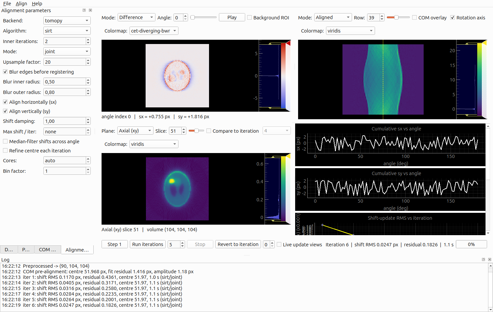

# ptycho-align — interactive reprojection alignment

An interactive GUI that drives the **iterative reprojection alignment** workflow for
ptychographic X-ray computed tomography (PXCT), built on TomoPy.

```bash
# Generate a synthetic misaligned dataset, then align it:
python examples/make_phantom.py --output phantom.h5 --noise 0.02
ptycho-align phantom.h5          # or: python -m tktomo.ptycho_align.ui.main_window phantom.h5
```



## Why this exists

`tomopy.prep.alignment.align_joint()` and `align_seq()` run their whole iteration
loop **internally** — no callback, no generator, no way to pause. The scientific
workflow needs the opposite: run one iteration, look at the tomogram, the
projections, the sinograms and the shift estimates, then run five more, then look
again.

So the loop here is a re-implementation of the Gürsoy et al. joint re-projection
algorithm on top of TomoPy's own building blocks (`recon`, `project`, `blur_edges`,
`shift_images`, `phase_cross_correlation`), exposed **one outer iteration at a
time**. `AlignmentEngine.step()` is an ordinary function call that returns control to
the caller, so the GUI — or a notebook — decides what happens between iterations.

> Gürsoy, D. et al. *Rapid alignment of nanotomography data using joint iterative
> reconstruction and reprojection.* **Sci. Rep. 7**, 11818 (2017).

## The workflow

1. **Load** a stack of ptychographic phase projections and their angles (HDF5,
   `.npy`/`.npz`, or a TIFF directory plus an angles file). See
   [Loading an HDF5 file of any layout](#loading-an-hdf5-file-of-any-layout).
2. **Preprocess** — phase-ramp and offset removal, optional unwrap, invert, pad.
3. **COM pre-alignment** — a centre-of-mass initial guess of the shifts and the
   rotation-axis position.
4. **Iterate** — Step once, or Run *N*, inspecting between iterations.
5. **Export** the aligned stack, the volume, the shifts, or save a session and
   resume later.

Each outer iteration reconstructs a volume from the currently-aligned sinogram,
forward-projects it at every measured angle, cross-correlates each measured
projection against its own reprojection to get a subpixel shift, accumulates that
shift and re-shifts the data — always from the pristine original, never by
re-warping already-warped data.

## Loading an HDF5 file of any layout

"Load projections…" probes the conventional locations (NXtomo `/entry/data/data`,
DXchange `/exchange/data`, the blender-sim per-output groups). Real ptycho pipelines
routinely write somewhere else entirely, so when the probe finds nothing — or when it
finds the *wrong* array, because the file holds several 3-D datasets — use
**"Browse HDF5…"** (also `File → Browse HDF5 datasets…`). It shows the file's actual
tree and you point at the array you mean:

- Pick the **projection stack**: any 3-D dataset, at any depth. Datasets that can be
  neither a stack nor an angle array are still listed, but greyed out.
- Pick the **angle array**: any 1-D dataset, or "None" to assume a uniform 0–180° scan.
  Units are auto-detected (a span above 2π is degrees) or forced.
- Pick the **axis order**. The alignment needs `(angle, v, u)`; a file saved as
  `(v, u, angle)` is read with `(2, 0, 1)`. Each option is labelled with the shape it
  produces — `angles=721, v=512, u=512` — so the right one is obvious.

OK stays disabled until the angle count and the stack's leading axis agree, which is
the mistake this dialog exists to catch: the right stack paired with the wrong 1-D
array loads silently and then aligns garbage.

The browser opens automatically if "Load projections…" is given an HDF5 file whose
layout it cannot recognise.

Headless, this is `data_path` / `angle_path` / `axis_order` on `load_dataset`:

```python
from tktomo.ptycho_align.core import list_hdf5_datasets, load_dataset

for entry in list_hdf5_datasets("beamline.h5"):
    print(entry.path, entry.shape, entry.dtype)

data = load_dataset(
    "beamline.h5",
    data_path="/recon/2024_08/ptycho/object_phase",
    angle_path="/recon/2024_08/ptycho/rotation",
    axis_order=(2, 0, 1),  # stored as (v, u, angle)
)
```

## Scripting it

`tktomo.ptycho_align.core` is headless and imports neither Qt nor (at import time)
TomoPy:

```python
from tktomo.ptycho_align.core import AlignConfig, AlignmentEngine, com_prealign, load_dataset

data = load_dataset("phantom.h5")
start = com_prealign(data.data, data.angles)

engine = AlignmentEngine(
    dataset=data,
    config=AlignConfig(recon_algorithm="sirt", recon_inner_iters=2, mode="joint"),
    sx0=start.sx, sy0=start.sy, center=start.center,
)

for result in engine.run(20):
    print(result.iteration, result.error, result.residual)
```

`mode="joint"` warm-starts the volume from the previous outer iteration (like
`align_joint`); `mode="sequential"` reconstructs from scratch each time (like
`align_seq`).

## Sign conventions (read this before changing the engine)

Three conventions were pinned down by reading TomoPy's source, and each is a bug if
you get it backwards. The engine test (`tests/test_ptycho_engine.py`) fails loudly on
all three.

- **Registration direction.** `phase_cross_correlation(reference, moving)` is called
  as `(measured, simulated)`. Reversing it negates every update, and the alignment
  diverges instead of converging.
- **Axis order.** TomoPy's `shift_images(prj, sx, sy)` has misleading parameter
  names: it builds a `SimilarityTransform(translation=(sy, sx))`, and skimage's
  `translation` is `(column, row)` — so its *first* argument is really the **row**
  shift. It is wrapped here as `apply_shifts(prj, sy, sx)` with honest names.
- **`shift_images` mutates its input** (it rescales in place), so it always gets a
  copy. The `original` array is immutable by contract.

`sx`/`sy` throughout are the **correction to apply**, not the displacement the object
currently has. The two differ by a sign, and the COM code returns the former.

## Unobservable shifts

You cannot compare recovered shifts to ground truth directly, because some shifts are
physically unobservable:

- A **constant** `sy` just translates the whole volume along the rotation axis.
- Translating the object in-plane by `(dx, dy)` shifts projection *i* horizontally by
  `dx·cos θᵢ + dy·sin θᵢ`, and a constant offset is absorbed by the rotation centre.
  So the horizontal degenerate subspace is `{sin, cos, 1}` — three modes, not one.

The engine removes the mean from `sx` and `sy` each iteration so these modes cannot
random-walk over a long run. `tests/test_ptycho_engine.py::observable_error` projects
both the recovered and the true shifts onto the observable complement before
comparing; without that, a perfectly correct alignment still "scores" ~0.2 px.

## Troubleshooting: my alignment is diverging

- **A residual phase ramp.** This is the first thing to check. A linear phase ramp
  across a projection is *mathematically indistinguishable* from a lateral shift, so
  the loop will dutifully "correct" a shift that is really a ramp, and never settle.
  Turn on "Remove phase ramp", and draw a background ROI over actual vacuum rather
  than relying on the default border frame if the object reaches the frame edge.
- **The sign convention.** See above. The symptom is unmistakable: the shift-update
  RMS grows instead of shrinking, and the difference image gets worse every iteration.
- **A bad centre.** Check the COM sinusoid fit plot. If the measured points do not sit
  on a clean sinusoid, something upstream is broken (usually the offset removal or the
  sign of the phase) and no centre estimate will save you. Try the Vo estimator.
- **An emission algorithm on phase data.** `mlem` and `osem` model photon *counts* with
  a multiplicative update and assume non-negative data. Phase projections are typically
  ~20% negative after ramp/offset removal, and feeding those to `mlem` makes it diverge
  explosively — measured on the demo phantom: residual 0.045 → 62 and shifts to 21 px
  within five iterations. Use `sirt`, `art`, or `gridrec`. The app now warns before
  starting such a run.
- **Too few inner reconstruction iterations.** With `recon_inner_iters` too low the
  reprojection is too blurry to register against, and the updates are noise. Raise it,
  or switch to `sequential` mode. Note that `sequential` reconstructs from scratch every
  outer iteration, so it needs *considerably* more inner iterations than `joint` to
  reach the same reprojection quality — with only 2, the residual will sit stubbornly
  high and barely move.
- **Missing-wedge artifacts** biasing the reprojection. If the angular range is well
  under 180°, the reconstruction is elongated along the missing direction and the
  reprojection inherits that bias. Constrain the fit: switch off `align_horizontal` or
  `align_vertical`, lower `shift_damping`, or clip with `max_shift_per_iter`.
- **Negative mass.** Phase is negative for most samples, but the reconstruction and
  the centroid both assume positive mass. The app warns; enable "Invert".
- **The object walks out of frame.** Shifting moves the object toward the edge. Pad by
  10–20 % before the loop (the Preprocess panel does this).

## Performance

- **Bin first.** The single biggest win on a large dataset: run at 2× or 4× binning
  until it converges, then set the bin factor back to 1 — the existing shifts are
  rescaled automatically, and you finish at full resolution from a good starting point.
- The aligned stack, the reprojection and their difference are cached once per
  iteration, so scrubbing the angle slider does not recompute a reprojection.
- Volumes are large, so only the last few iterations' volumes are kept in memory (plus
  every *N*th). Shift arrays are kept for every iteration, so "revert to iteration N"
  always works; if that iteration's volume was dropped, the next step simply
  reconstructs from scratch instead of warm-starting.
- All heavy computation runs on a `QThread`. The GUI never blocks, and Stop finishes
  the current iteration before returning — a cancelled run always leaves a valid state.
